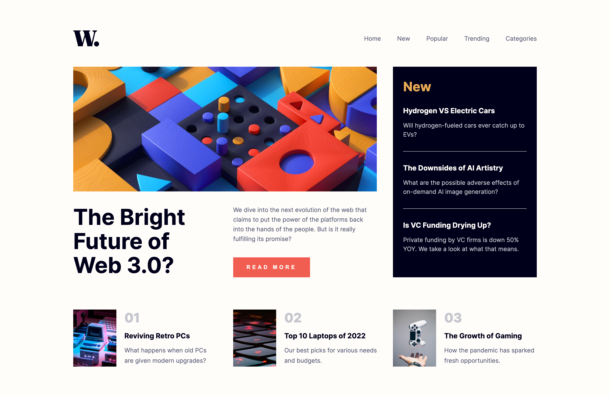

# Frontend Mentor - News homepage solution

This is a solution to the [News homepage challenge on Frontend Mentor](https://www.frontendmentor.io/challenges/news-homepage-H6SWTa1MFl).

## Overview

### The challenge

Users should be able to:

- View the optimal layout for the interface depending on their device's screen size
- See hover and focus states for all interactive elements on the page
- **Bonus**: Toggle the mobile menu with JavaScript

### Screenshot

### Links

- Live Site URL: [News Homepage](https://fabulous-bunny-7039f6.netlify.app/)

## My process

### Built with

- HTML5
- CSS Flexbox
- CSS Grid
- JavaScript

### What I learned + future focus

The main purpose for completing this project was to practice creating responsive layouts with pure CSS using Grids and Flexbox. The primary challenges included making the optimal layout decisions based on JPEG design files and implementing the toggle for mobile menu with vanilla JS.

In future projects I want to focus on Mobile-first workflow and DRY principle for more maintainable and reusable code.

## Author

- Github - [jane-doronina](https://github.com/jane-doronina)
- LinkedIn - [@zhanna-doronina](https://www.linkedin.com/in/zhanna-doronina/)
